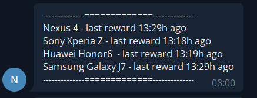
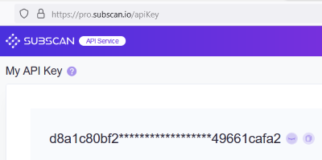
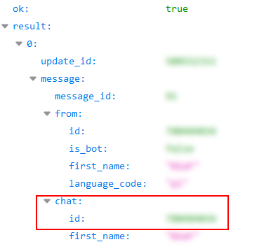

# NodleCheck

Skrypt sprawdza kiedy ostatni raz pojawiła się nagroda dla zdefiniowanych portfeli. Jeśli jest większa niż wartość określona w `alert_time` (domyślnie 12h) przychodzi alert na telegram.

### Wymagane ustawienia w konfiguracji:
`subscan_token` - należy zarejestrować się na https://pro.subscan.io/login (wystarczy darmowy plan) i skorzystać z wygenerowanego tokena api 

`telegram_chatid` - wysłanie do bota http://t.me/Nodle_Wallet_Checker_bot komendy **/start**, następnie otwarcie w przeglądarce https://api.telegram.org/bot5578491077:AAG4dWtmcdE2bCyCxULHP_xCRAgQraISMJE/getUpdates i pobranie wartości chat[id] 

*Można stworzyć własnego bota - opis na https://core.telegram.org/bots#6-botfather*

`enable_telegram` - wysyła wynik na Telegram 

`enable_console` - wysyła wynik na konsolę

`show_all` - pokazuje wyniki dla wszystkich portfeli zdefiniowanych w `wallets.txt`

`show_problem` - pokazuje jedynie problematyczne portfele (przekraczające `alert_time`)

### wallets.txt
W pliku wallets.txt umieszamy opis koparki oddzielony średnikiem od klucza **publicznego** (przykładowe adresy znalezione w sieci:P)

### Cron
W celu automatyzacji skrypt odpalamy w cronie (np w przykładzie co 4h)

`0 */4 * * * /usr/bin/python3 /opt/nodle/nodlecheck.py`

Wszelakie sugestie i uwagi mile widziane - znajdziesz mnie na https://discord.com/channels/783056826618216498/887572254987288606 

### Sponsor

NODLE address: 4mfeRtTcRtaguaq7swCbDKdEzm4ELeJPmW2M9aifpDHbVk9C
